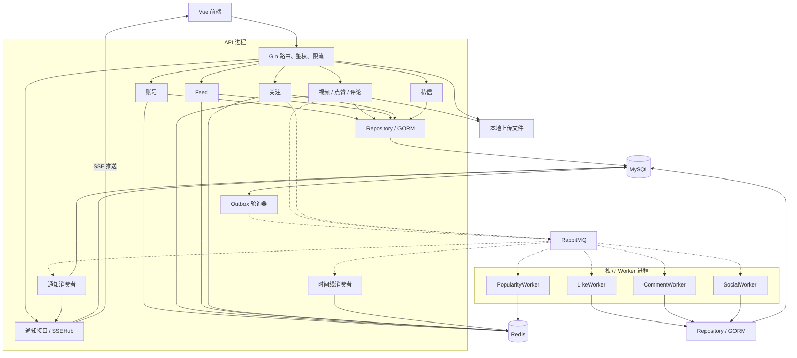
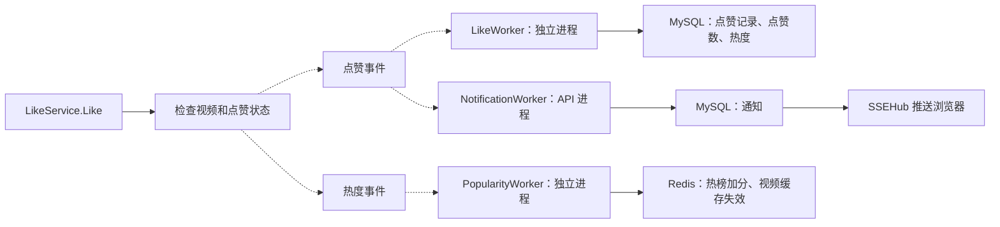

# 项目架构与业务调用链学习指南

本文面向已有 SQL 和 Go 基本语法、正在学习后端开发的读者。依据当前代码中的**实际路由和调用关系**整理；重点是先看清请求如何穿过各层，再逐步理解 Redis、RabbitMQ 和 Worker。

## 1. 项目解决什么问题

这是一个 Go + Vue 3 短视频 Feed 系统。用户可以注册登录、上传和发布视频、浏览最新/关注/话题视频流、点赞、评论、关注作者、收发私信，并接收互动通知。它还支持分片上传、断点续传、排行榜和 Docker Compose 部署。

从后端角度，它同时处理三类问题：

| 问题 | 实现方式 |
| --- | --- |
| 如何接收请求、校验身份、保存业务数据？ | Gin + JWT + GORM + MySQL |
| 视频列表被反复读取，如何加快查询？ | Redis 缓存与排序集合、少量进程内缓存 |
| 点赞、评论还要更新热度、发送通知，如何拆开执行？ | RabbitMQ 事件和后台 Worker |

这里的 Feed 指连续浏览的视频列表。现有代码以时间、点赞数、热度、关注关系和话题查询视频，没有机器学习推荐模型。

## 2. 目录结构及各层职责

```text
feedsystem_video_go/
├─ backend/
│  ├─ cmd/
│  │  ├─ main.go             HTTP API 进程入口
│  │  └─ worker/main.go      独立 Worker 进程入口
│  ├─ configs/              各运行环境的 YAML 配置
│  └─ internal/
│     ├─ http/              组装模块依赖、注册 Gin 路由
│     ├─ account/           账号、登录、资料
│     ├─ video/             视频、上传、点赞、评论、话题
│     ├─ feed/              最新流、关注流、排行榜等查询
│     ├─ social/            关注关系
│     ├─ message/           私信
│     ├─ worker/            MQ 消费、时间线、通知、SSE
│     ├─ middleware/        JWT、限流、Redis 和 RabbitMQ 封装
│     ├─ auth/              JWT 的生成和解析
│     ├─ db/                MySQL 连接和 GORM AutoMigrate
│     ├─ config/            配置读取和环境变量覆盖
│     ├─ apierror/          错误与 HTTP 状态码
│     └─ observability/     pprof
├─ frontend/               Vue 3 页面、API 调用、状态管理
├─ test/                   Postman 集合
├─ picture/                原有设计图
├─ docker-compose.yml      MySQL、Redis、RabbitMQ、API、Worker、前端
└─ start.sh                本地启动脚本
```

典型 HTTP 请求沿着 `Router → Middleware → Handler → Service → Repository → MySQL` 前进：

| 层 | 主要职责 | 学习时要回答的问题 |
| --- | --- | --- |
| Router | 创建依赖、注册路径和中间件 | 这个 URL 进入哪个 Handler？ |
| Middleware | 鉴权、限流 | 请求能否继续？当前用户是谁？ |
| Handler | 读取 JSON/文件，返回 HTTP 响应 | HTTP 输入如何变为业务输入？ |
| Service | 校验业务规则，组织数据、缓存、消息操作 | 这件业务要按什么顺序完成？ |
| Repository | 通过 GORM 查询或修改 MySQL | 对应哪些 SQL 读写？ |
| Entity/Request/Response | 定义表模型与接口数据结构 | 输入、存储和输出各有什么字段？ |
| Worker | 消费事件、处理后台任务 | HTTP 返回后还要做什么？ |

这是主要模式，不是每个模块都严格遵守：视频发布和点赞降级的事务直接写在 Service 中；个人主页聚合写在路由闭包中；通知接口直接使用 GORM；私信 Service 基本只持有 Repository。`middleware/redis` 和 `middleware/rabbitmq` 主要是基础设施封装，不是 Gin HTTP 中间件。

## 3. 从 main 到 Gin 启动

API 入口：[backend/cmd/main.go](../backend/cmd/main.go)。调用顺序：

```text
main()
  → 加载 .env
  → 确定 CONFIG_PATH（默认 configs/config.yaml）
  → config.LoadLocalDev：读取 YAML、应用环境变量；配置文件不存在时用默认值
  → db.NewDB：GORM 连接 MySQL
  → db.AutoMigrate：根据实体创建或调整表结构
  → 初始化 Redis 并 Ping；不可用时把 cache 设为 nil，继续启动
  → 初始化 RabbitMQ；不可用时把 rmq 设为 nil，继续启动
  → 按配置启动 pprof
  → http.SetRouter(db, cache, rmq)
  → gin.Engine.Run(":端口")，开始监听请求
```

[SetRouter](../backend/internal/http/router.go) 先调用 `gin.Default()`，注册 `/healthz` 和 `/static`，创建限流器，再按模块手动组装 `Repository → Service → Handler` 并绑定路由。它还启动 Outbox 轮询、时间线消费和通知消费 goroutine，最后返回 Gin Engine。Redis、RabbitMQ 在 API 中可选，但具体功能不一定都能无损降级，例如分片上传没有 Redis 会返回 503。

独立入口 [backend/cmd/worker/main.go](../backend/cmd/worker/main.go) **不启动 Gin**。它连接 MySQL、Redis、RabbitMQ，声明消息拓扑，为 LikeWorker、CommentWorker、SocialWorker、PopularityWorker 分别启动消费 goroutine，然后等待退出信号。PopularityWorker 依赖 Redis。

因此要区分两类后台工作：`cmd/worker` 是独立进程；Outbox、时间线和通知消费者在 API 进程内运行。

## 4. 五个核心技术分别在哪里使用

| 技术 | 代码中的主要位置 | 本项目里的作用 |
| --- | --- | --- |
| Gin | `internal/http`、各模块 Handler、JWT/限流、SSEHub | 路由、参数绑定、鉴权、返回 JSON、文件上传、SSE 长连接 |
| GORM | `internal/db`、各 Repository、部分 Service/Worker | 把 Go 数据操作转换为 SQL，映射实体、执行事务和迁移 |
| MySQL | API 和独立 Worker 共用 | 持久保存账号、视频、点赞、评论、关注、标签、私信、通知、Outbox |
| Redis | 账号/鉴权、视频/Feed、分片上传、限流、热度 | Token 缓存、对象缓存、排序集合、临时会话、请求计数和短期锁 |
| RabbitMQ | `middleware/rabbitmq` 发布，`worker` 消费 | 在 API 和后台任务之间传递事件 |

有 SQL 基础时，可将 GORM 理解为组织数据库操作的 Go 工具：`Repository 的 GORM 调用 → SQL → MySQL`。连接与迁移在 [backend/internal/db/db.go](../backend/internal/db/db.go)。

Redis 在这里有几种不同用法，建议逐个理解：

| 场景 | 保存的内容 | 用途 |
| --- | --- | --- |
| Token | 当前 access/refresh token 信息 | 减少鉴权查询；MySQL 保存当前有效 Token |
| 视频详情与实体 | 序列化的视频对象 | 命中后减少数据库查询 |
| 最新时间线 | 视频 ID，分数是发布时间 | 按时间快速取视频 ID |
| 热榜 | 视频 ID，分数是热度 | 排序及分钟窗口聚合 |
| 关注流 | 某用户某一页的结果 | 减少重复查询 |
| 分片上传 | 上传会话与已完成分片 | 支持续传 |
| 限流与锁 | 请求计数、短期锁标记 | 控制请求量、减少同时回源 |

其中 **ZSET 是按分数排序的集合**：时间线把发布时间当分数，热榜把热度当分数。

RabbitMQ 可以理解为事件的中转站。API 发布事件后可以返回，Worker 稍后消费并写库、更新缓存或生成通知。因此应区分“HTTP 请求完成”“消息发布完成”“后台处理完成”三个时间点。消息的发布与消费代码分别见 [rabbitmq](../backend/internal/middleware/rabbitmq) 和 [worker](../backend/internal/worker)。

### Worker 是什么

**Worker 是持续运行、负责处理后台任务的程序或任务循环，不是某个 Go 语法特性。** 用户的 HTTP 请求交给 Gin Handler；Worker 通常不接收用户请求，而是等待 RabbitMQ 队列里的消息，取出消息后执行工作。这里的“异步”表示发起请求的一方与处理任务的一方不必在同一段调用栈里等待彼此完成。

以点赞为例：

```text
用户请求 POST /like/like
  → Gin Handler → LikeService 检查数据
  → LikeMQ 向 RabbitMQ 发布「用户 A 点赞视频 B」事件
  → API 可以给用户返回响应

另一边，持续运行的 LikeWorker：
  → 从队列收到事件
  → 解析出用户 ID、视频 ID 和动作
  → 写入 likes 表，增加 videos.likes_count 和 popularity
  → 处理成功后 Ack（确认消息）
```

消息通过 **exchange（交换机）→ routing key（路由键）→ queue（队列）** 交给相应消费者。一个队列收到一条消息后，通常由该队列的一个消费者处理；同一个事件也可以被投递到多个不同队列。在点赞例子中，点赞落库队列和通知队列各收到一份事件，分别处理数据库写入和通知。热度更新是另外发布的一类事件。

`cmd/worker` 是单独启动的 Go **进程**；它的 `main` 为每一类 Worker 启动一个 goroutine，每个 Worker 使用独立的 RabbitMQ Channel 持续消费。消息处理失败会在消费代码中重试；成功后 Ack，达到重试上限时当前代码也会 Ack 并记录丢弃日志，进程停止时则尝试 Nack 重新入队。可从 [Worker 入口](../backend/cmd/worker/main.go) 和 [LikeWorker](../backend/internal/worker/likeworker.go) 对照阅读。

本项目还有运行在 **API 进程内部**的后台循环：Outbox 轮询器发送视频发布时间线事件，时间线消费者把视频 ID 写入 Redis，通知消费者写通知表并向 SSEHub 推送。它们也是 Worker 式工作，但并不运行在 `cmd/worker` 进程中。

| 对比 | Gin Handler | Worker |
| --- | --- | --- |
| 工作由谁触发 | 用户发来 HTTP 请求 | 队列消息或定时轮询 |
| 工作何时开始 | 请求到达时 | 有消息或轮询到任务时 |
| 结果交给谁 | 直接返回 HTTP 响应 | 更新 MySQL/Redis、发送通知；一般不直接回答原请求 |
| 在本项目中运行在哪里 | API 进程 | 独立 Worker 进程，或 API 进程内的后台 goroutine |

## 5. 核心模块调用关系

实线表示直接调用或读写，虚线表示经 RabbitMQ 传递事件。



模块之间的业务依赖包括：Feed 组合视频、点赞、关注、标签信息；点赞与评论检查视频并影响热度；关注检查双方账号；个人主页聚合账号、视频和关注统计；通知事件还要找到接收者。这些模块共用一个 MySQL，而非各自独立存储的服务。

## 6. 全部业务调用链

以 [路由注册](../backend/internal/http/router.go) 为准，下面覆盖当前**已注册**的业务接口。表中 `H / S / R` 依次代表该模块的 Handler / Service / Repository。除 `GET /notification/stream` 外，这些接口都使用 POST。前端默认请求 `/api/...`，Vite 或 Nginx 去掉 `/api` 前缀后交给 Gin。

### 账号 `/account`

| 路径 | 业务作用 | 调用链 |
| --- | --- | --- |
| `/register` | 创建新账号 | IP 限流 → H.CreateAccount → S.CreateAccount → bcrypt 哈希密码 → R.CreateAccount → MySQL |
| `/login` | 验证密码并登录 | IP 限流 → H.Login → 查询账号 → S.Login 校验密码、生成双 Token → R.Login 保存 Token → Redis 缓存 → 返回登录信息 |
| `/refresh` | 用刷新 Token 换新访问 Token | H.Refresh → S.RefreshAccessToken → Redis 查找并用 MySQL 核对账号；失败时遍历 MySQL 账号匹配 → 保存新 access token |
| `/logout` | 退出登录并使 Token 失效 | JWT → H.Logout → S.Logout → 删除 Redis Token → R.Logout 清空 MySQL 中的双 Token |
| `/changePassword` | 验证旧密码后修改密码 | H.ChangePassword → 查询账号、验证旧密码 → 哈希新密码 → R.ChangePassword → S.Logout |
| `/rename` | 修改当前用户的用户名 | JWT → H.Rename → S.Rename → 生成新 Token → R.RenameWithToken 事务更新用户名/Token → 更新 Redis |
| `/findByID` | 按用户 ID 查账号 | H.FindByID → S.FindByID → R.FindByID → MySQL |
| `/findByUsername` | 按用户名查账号 | H.FindByUsername → S.FindByUsername → R.FindByUsername → MySQL |
| `/uploadAvatar` | 上传并设置当前用户头像 | JWT → H.UploadAvatar → 校验并保存文件 → S.UpdateAvatar → R.UpdateAvatar 保存 URL |
| `/updateProfile` | 更新个人简介或头像地址 | JWT → H.UpdateProfile → S.UpdateProfile → R.UpdateFields → MySQL |
| `/getProfile` | 查看用户主页和统计数据 | 路由内处理函数 → AccountService 查资料 + VideoRepository 查作品数/获赞数 + SocialRepository 查粉丝数/关注数 → 聚合返回 |

普通受保护接口的公共前置链是：`Authorization Token → 验证 JWT → Redis 核对当前 Token；必要时查 MySQL → 将 accountID/username 放入 Gin Context → Handler`。Feed 的软鉴权允许无 Token 浏览，带了无效 Token 则拒绝请求。见 [JWT 中间件](../backend/internal/middleware/jwt/jwt.go)。

### 视频与上传 `/video`

| 路径 | 业务作用 | 调用链 |
| --- | --- | --- |
| `/uploadVideo` | 上传完整视频文件，取得播放地址 | JWT → H.UploadVideo → 校验视频文件 → 保存到本地磁盘 → 返回播放 URL |
| `/uploadCover` | 上传封面图片，取得封面地址 | JWT → H.UploadCover → 校验图片 → 保存到本地磁盘 → 返回封面 URL |
| `/chunk/init` | 开始或恢复一次分片上传 | JWT → ChunkUploadHandler → 从 Redis 查可续传会话或创建新会话 |
| `/chunk/upload` | 上传视频的一个分片 | JWT → 读取并检查会话归属 → 校验分片 MD5 → 分片写磁盘 → 更新 Redis 已完成状态 |
| `/chunk/status` | 查询哪些分片已上传 | JWT → 读取 Redis 会话、验证归属 → 返回已上传分片 |
| `/chunk/complete` | 合并分片，取得播放地址 | JWT → 检查分片齐全 → 合并磁盘文件 → 清理临时分片和 Redis 会话 → 返回播放 URL |
| `/publish` | 用标题、视频和封面地址发布作品 | JWT → H.PublishVideo → S.Publish → MySQL 事务写入视频、Outbox 待发送消息、话题及关联 |
| `/listByAuthorID` | 查看某位作者发布的视频 | H.ListByAuthorID → S.ListByAuthorID → R.ListByAuthorID → MySQL |
| `/getDetail` | 查看一条视频的详情 | H.GetDetail → S.GetDetail → Redis 命中直接返回；未命中则查 MySQL 并回填缓存 |

**上传文件与发布视频是两步。** 上传返回 URL；调用 `/publish` 后才有视频业务记录。分片上传详情见 [chunk_handler.go](../backend/internal/video/chunk_handler.go)。

发布后的时间线更新是一条独立链：

```text
VideoService.Publish
  → 同一 MySQL 事务写 Video、OutboxMsg、Tag/VideoTag
  → API 内 StartOutboxPoller 扫描待发送记录
  → TimelineMQ.PublishVideo → RabbitMQ 时间线队列
  → API 内 StartConsumer → Redis feed:global_timeline
```

Outbox 是放在 MySQL 的待办消息表：先与视频一起提交，再由后台发送到 MQ。见 [视频发布事务](../backend/internal/video/video_service.go) 与 [Outbox 处理](../backend/internal/worker/outboxworker.go)。

### 点赞 `/like`

四条路径均要求 JWT；写操作另有限流。

| 路径 | 业务作用 | 调用链 |
| --- | --- | --- |
| `/like` | 当前用户给视频点赞 | H.Like → S.Like 检查视频及当前状态 → 发布点赞事件与热度事件；发布失败的分支直接写 MySQL/Redis |
| `/unlike` | 取消当前用户对视频的点赞 | H.Unlike → S.Unlike 检查视频及当前状态 → 发布取消事件与负向热度事件；失败分支直接处理 |
| `/isLiked` | 查询当前用户是否已点赞某视频 | H.IsLiked → S.IsLiked → R.IsLiked → MySQL |
| `/listMyLikedVideos` | 查看当前用户点赞过的视频 | H.ListMyLikedVideos → S.ListLikedVideos → R.ListLikedVideos → MySQL 联查点赞、视频 |

`/like` 成功发布消息后会分成三条后台链：



点赞事件从 `like.events` 交换机投递到点赞业务队列；通知队列也绑定同一事件，所以各自收到一份。热度事件通过另一个交换机和队列处理。`LikeWorker` 更新 MySQL 后确认消息，`PopularityWorker` 更新 Redis 热榜并删除相关视频缓存，`NotificationWorker` 写通知并推送 SSE。因此点赞接口返回成功时，列表中的点赞状态、热度和通知可能还没更新。若发布消息失败，`LikeService` 会对相应部分直接写 MySQL 或更新 Redis。取消点赞发布相反动作及负向热度事件，但没有订阅“取消点赞通知”的队列。见 [点赞业务层](../backend/internal/video/like_service.go)、[LikeWorker](../backend/internal/worker/likeworker.go) 和 [通知 Worker](../backend/internal/worker/notificationworker.go)。

### 评论 `/comment`

| 路径 | 业务作用 | 调用链 |
| --- | --- | --- |
| `/publish` | 给视频发表评论 | JWT、限流 → H.PublishComment → 查当前账号 → S.Publish 检查视频 → 发布评论和热度事件；失败分支直接处理 |
| `/delete` | 删除自己发表的评论 | JWT、限流 → H.DeleteComment → S.Delete 查询评论、确认作者 → 发布删除消息，由 CommentWorker 删除；失败则直接删除 |
| `/listAll` | 查看某视频的评论列表 | H.GetAllComments → S.GetAll 检查视频存在 → R.GetAllComments → MySQL |

发布后的分支：`评论事件 → CommentWorker → 评论及 MySQL 热度`；同一事件也到 `NotificationWorker → 视频作者通知及 SSE`；热度事件到 `PopularityWorker → Redis 热榜`。内容中的 `@用户名` 由 `notifyMentions` 直接写入通知表，当前没有走 SSE 推送。删除评论没有对应的热度扣减。见 [评论业务层](../backend/internal/video/comment_service.go)。

### 关注 `/social`

五条路径均要求 JWT；关注和取关还有限流。`Vlogger` 指被关注的作者。

| 路径 | 业务作用 | 调用链 |
| --- | --- | --- |
| `/follow` | 当前用户关注一位作者 | H.Follow → S.Follow 检查双方账号及关系 → R.Follow 同步写 MySQL → 删除关注流缓存 → 发布关注事件 |
| `/unfollow` | 取消关注一位作者 | H.Unfollow → S.Unfollow 检查账号及关系 → R.Unfollow 同步删除 → 删除关注流缓存 → 发布取关事件 |
| `/getAllFollowers` | 查看某位用户的粉丝 | H → S 检查账号 → R 查询粉丝及用户资料，再查粉丝总数 |
| `/getAllVloggers` | 查看某位用户关注的作者 | H → S 检查账号 → R 查询所关注作者及用户资料，再查关注总数 |
| `/getCounts` | 查询当前用户的粉丝数和关注数 | H.GetCounts → S.CountFollowers/CountVloggers → R → MySQL |

关注主请求**先同步写库**。之后事件还会到独立 SocialWorker（再次按事件写入或删除关系），关注事件也会被通知消费者处理。不要把关注与点赞理解为完全相同的异步落库流程。见 [关注业务层](../backend/internal/social/service.go)。

### Feed `/feed`

Feed 就是“给用户返回一页视频”。这五条路径解决的是**看哪一类视频**；路径均为 `FeedHandler → FeedService`，之后的查询策略各不相同。最新流、点赞榜、热榜、话题流可不登录浏览；关注流必须登录。

| 完整路径 | 业务作用：用户会看到什么 | 查询链路 |
| --- | --- | --- |
| `/feed/listLatest` | **最新流**：全站新发布的视频，越新越靠前 | Redis 全局时间线取 ID → 进程内缓存 → Redis 视频实体缓存 → MySQL；冷数据从 MySQL 查，并按需拼接 |
| `/feed/listLikesCount` | **点赞榜**：按视频累计获赞数从高到低看 | FeedRepository → MySQL 按点赞数、ID 排序，使用复合游标分页 |
| `/feed/listByPopularity` | **近期热榜**：看最近一段时间互动较多的视频 | Redis 最近 60 个分钟热度窗口合并为快照 → 根据 ID 查视频；不可用时按 MySQL 热度排序 |
| `/feed/listByFollowing` | **关注流**：只看自己关注的作者发布的视频 | JWT → Redis 关注流页面缓存；未命中则 MySQL 按关注关系筛选视频并缓存 |
| `/feed/listByTag` | **话题流**：只看带指定 `#话题` 的视频 | MySQL 联查 `videos`、`video_tags`、`tags` |

**点赞榜**按视频历史累计点赞数排；**近期热榜**优先根据 Redis 中最近 60 个分钟窗口的热度排，两者可能给出不同顺序。多数查询结果还经 `buildFeedVideos → LikeRepository.BatchGetLiked` 补充当前用户是否点赞；关注流若直接命中整页缓存则直接返回缓存结果。最新流在 Redis 时间线为空时，会查 MySQL 最新 1000 条并重建时间线。见 [FeedService](../backend/internal/feed/service.go)。

### 私信 `/message`

| 路径 | 业务作用 | 调用链 |
| --- | --- | --- |
| `/send` | 给指定用户发送私信 | JWT → Handler.Send → `service.repo.Send` → MySQL 保存消息 |
| `/list` | 查看与指定用户的最近私信 | JWT → Handler.List → `service.repo.List` → MySQL 查询与指定用户最近 50 条消息 |

私信目前没有使用 RabbitMQ 或通知 SSE。见 [私信实现](../backend/internal/message/handler.go)。

### 通知 `/notification`

| 路径 | 业务作用 | 调用链 |
| --- | --- | --- |
| `GET /stream` | 实时接收互动通知 | SSERequireAuth → SSEHandler → 订阅当前用户的内存 channel → 持续写入 SSE 事件 |
| `POST /list` | 查看最近的通知 | SSERequireAuth → ListHandler → MySQL 查询最近 50 条通知 |
| `POST /markRead` | 将单条或全部通知标记已读 | SSERequireAuth → MarkReadHandler → MySQL 标记单条或全部已读 |
| `POST /unreadCount` | 查看未读通知数量 | SSERequireAuth → UnreadCountHandler → MySQL 统计未读数 |

SSE 使用一条保持打开的 HTTP 连接向浏览器推送事件。通知的 `SSERequireAuth` 当前只解析验证 JWT，没有复用普通 `JWTAuth` 对 Redis/MySQL 当前 Token 的核对。见 [SSEHub](../backend/internal/worker/ssehub.go)。

`/healthz` 与 `/static` 分别用于健康检查和访问上传文件，不属于业务链。代码中存在 `DeleteVideo`、`UpdateLikesCount` Handler，但当前没有注册路由。

## 推荐最先阅读的三条链

建议按 **同步数据库操作 → 缓存 → 消息队列** 的顺序读。

1. **注册账号**：`POST /account/register → AccountHandler.CreateAccount → AccountService.CreateAccount → AccountRepository.CreateAccount → MySQL`。先看 JSON 绑定、密码哈希、GORM 插入与错误返回，把 GORM 操作对应到熟悉的 SQL `INSERT`。阅读：[Handler](../backend/internal/account/handler.go) → [Service](../backend/internal/account/service.go) → [Repository](../backend/internal/account/repo.go)。
2. **查询视频详情**：`POST /video/getDetail → VideoHandler.GetDetail → VideoService.GetDetail → Redis / MySQL`。先弄懂缓存命中、未命中、回填、过期，再看锁和等待重试。这比一开始读完整 Feed 更适合学习 Redis。阅读：[Handler](../backend/internal/video/video_handler.go) → [Service](../backend/internal/video/video_service.go) → [Repository](../backend/internal/video/video_repo.go)。
3. **点赞**：`POST /like/like → LikeHandler.Like → LikeService.Like → LikeMQ → RabbitMQ → LikeWorker → MySQL`。第一遍只追点赞落库，第二遍加入热度和通知分支，第三遍看发布失败、重复消息和重试。阅读：[Handler](../backend/internal/video/like_handler.go) → [Service](../backend/internal/video/like_service.go) → [消息发布](../backend/internal/middleware/rabbitmq/likeMQ.go) → [Worker](../backend/internal/worker/likeworker.go)。

读完这三条，再沿“登录 → 普通 JWT 鉴权 → 发布视频 → Outbox 时间线 → 最新 Feed”把最主要的产品闭环串起来。
